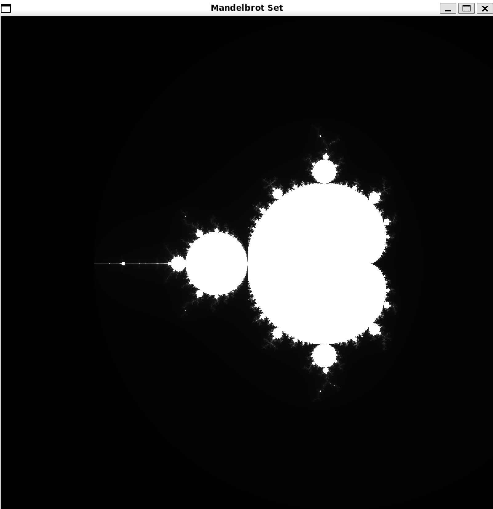
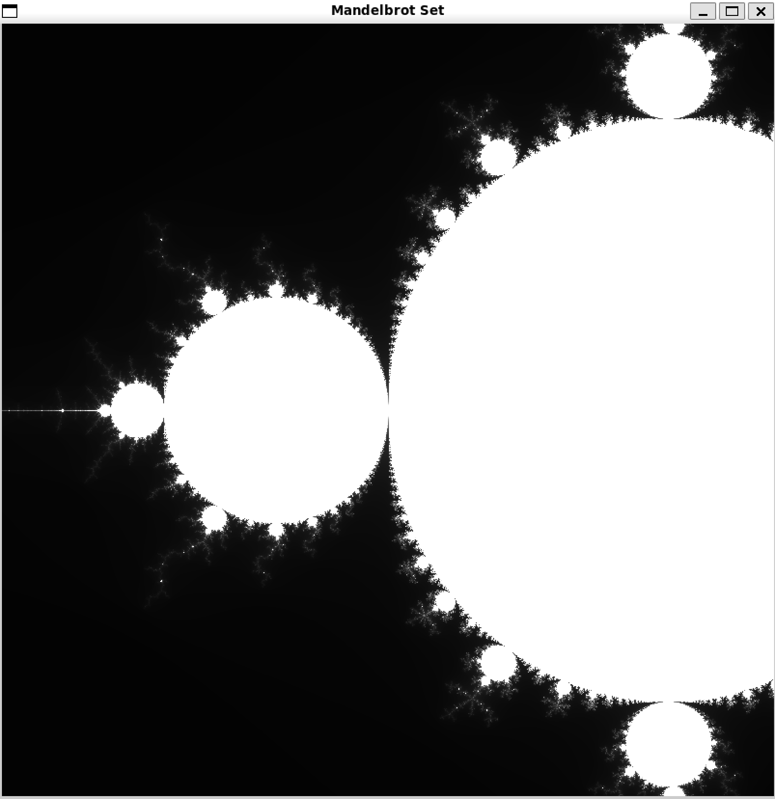
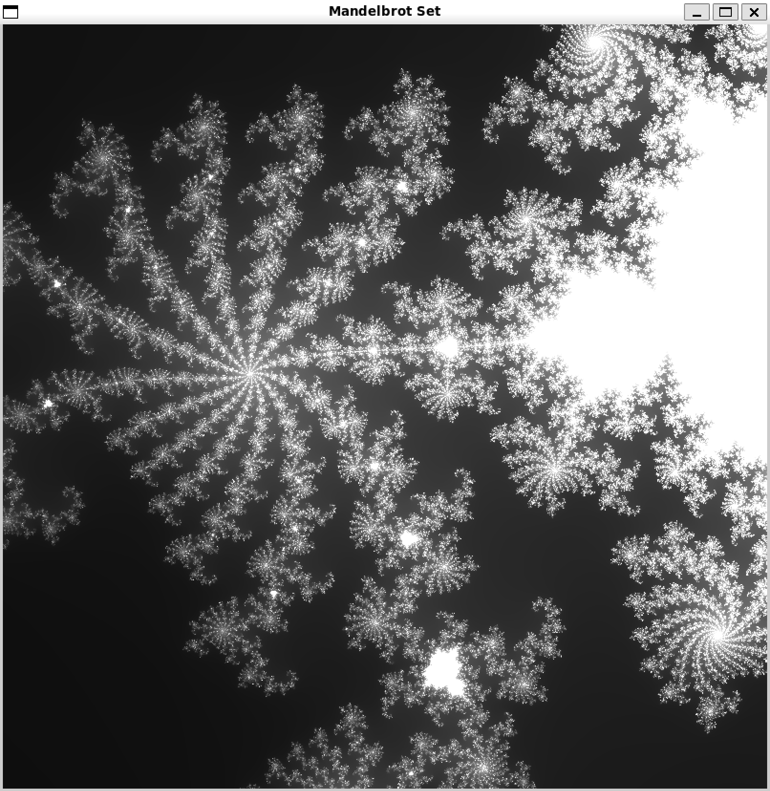

# Mandelbrot Set visualization using x86-64 assembly language
This project is a graphical application that visualizes the Mandelbrot set using the Allegro 5 library. The application allows users to interactively explore the Mandelbrot set by zooming and panning through the fractal.

In order to run this program, you need to have installed:
- `gcc` - C compiler
- `allegro` - image library
- `cmake` - compilation tool

First you need clone this repository using:
```bash
git clone https://github.com/kpta119/MandelbrotSet_Intelx86.git
```
Next steps after cloning:
```bash
cd MandelbrotSet_Intelx86
mkdir build
cd build
cmake ..
make
```
and to run the program:
```bash
./mandelbrot
```
- After this you should see generated Mandelbrot Set:


- You can zoom in or zoom out using scroll on your mouse


- Or you can move the image by clicking left mouse button and moving the mouse

